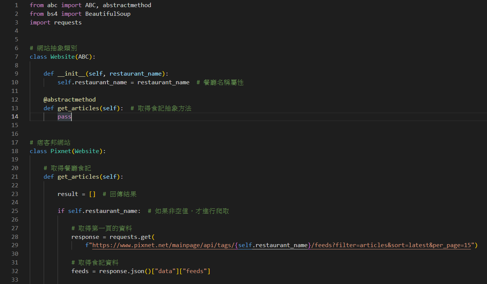
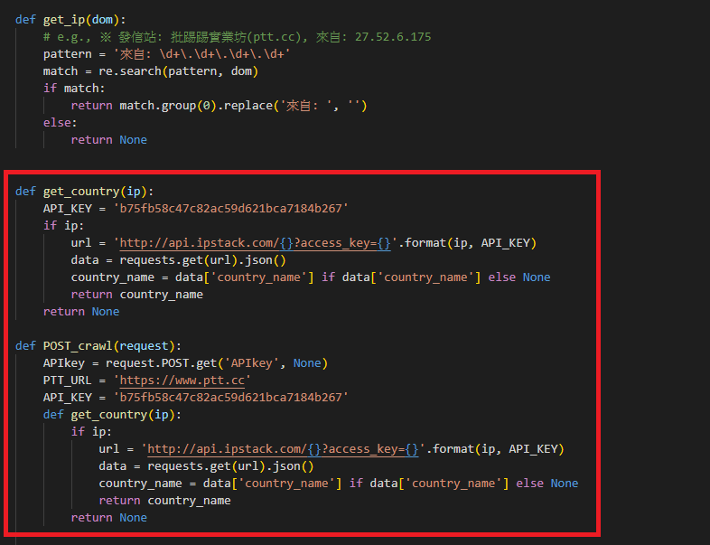
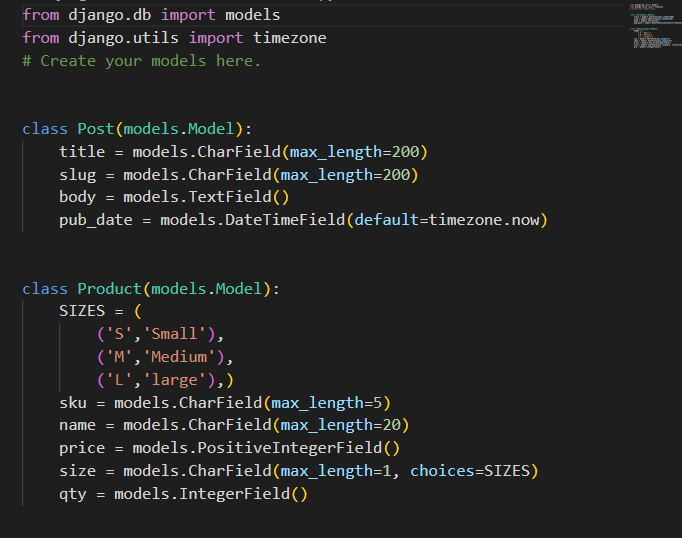

# Meetjobs Class Project

- ## BlogSearch🔋

 <strong>學習使用爬蟲搜尋痞客邦網頁內容.</strong> 

- ## PTT_APIKEY🔋

 
 

 <strong>學習使用APIKEY搜尋PTT網頁內容.</strong> 

- ## LIST_Form🔋

 <strong>學習使用Django建立表單,admin建置內容新增與刪除.</strong> 

